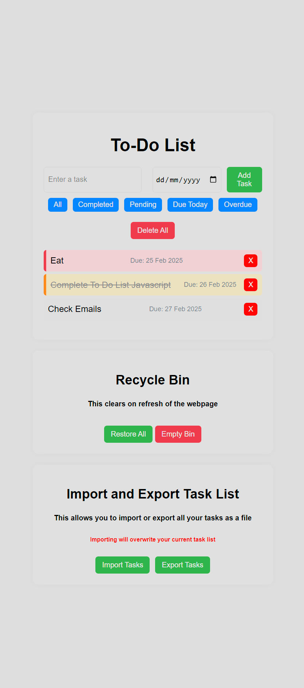

# To Do List - Broaden JavaScript Knowledge 

- Deployed project can be found [here](https://charlieflockhart.github.io/To-Do_Javascript/).

## About This Project  

I created this to-do list app as a personal project to enhance my JavaScript skills and build something practical for my portfolio. The goal is to explore modular JavaScript development, improve my understanding of event handling, local storage, and drag-and-drop functionality, and create a well-structured, maintainable application.  

This project also serves as a hands-on experience in working with JSON data import/export and implementing user-friendly task management features.  

# Features  

## Task Management  
- Add new tasks with a name and due date.  
- Edit task names by double-clicking.  
- Edit due dates by double-clicking.  
- Mark tasks as completed by clicking on them.  
- Drag and drop tasks to reorganize their order.  

## Task Filtering  
- View tasks by:  
  - **All** – Shows all tasks  
  - **Completed** – Displays only completed tasks  
  - **Pending** – Displays only incomplete tasks  
  - **Due Date** – Sorts tasks by due date  
  - **Overdue** – Highlights overdue tasks  

## Task Deletion & Recycle Bin  
- Delete individual tasks (moved to the recycle bin).  
- Delete all tasks in the list (moved to the recycle bin).  
- Restore all tasks from the recycle bin back to the list.  
- Permanently delete all tasks from the recycle bin.  
- Permanently delete individual tasks from the recycle bin.  

## Import & Export  
- Export all tasks to a JSON file.  
- Import a JSON file to restore saved tasks.  

# Validation
- All HTML Files Validated and Passed
- All CSS Files Validated and Passed
- All JavaScript Files Validated and Passed